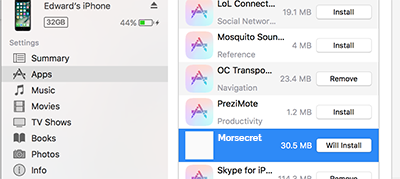
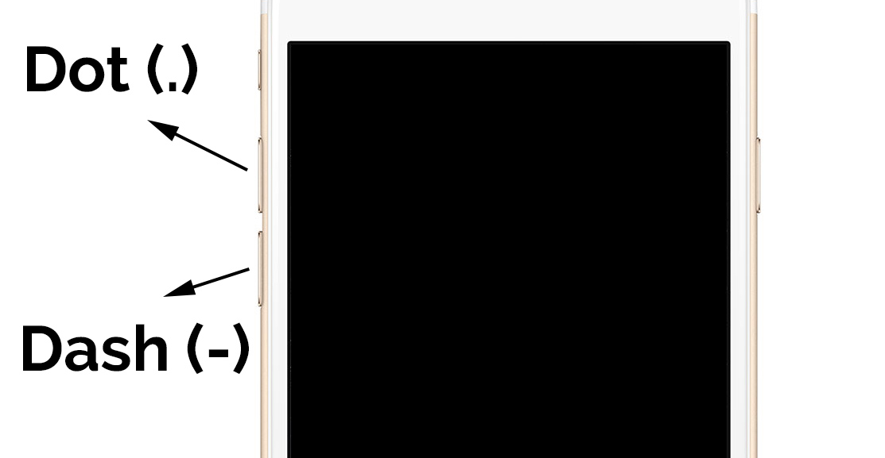

# Morsecret

This is an application that integrates steganography with haptic feedback to communicate in real-time via morse code using a Firebase database. A unique haptic 'stealth' mode can be enabled to only receive messages via phone vibrations and send messages via the up and down volume buttons.

### .... . .-.. .-.. ---  .-- --- .-. .-.. -..

# Links

1. [Requirements](#requirements)
2. [Setup](#setup)
   * [Download](#download)
   * [Installation](#installation)<br/>
3. [Stealth Features](#stealth-features)
   * [Information Output](#information-output)
   * [Information Input](#information-input)<br/>
4. [Rules](#rules)
   * [Special Combinations](#special-combinations)<br/>
5. [Responsible Use](#responsible-use)
6. [License](#license)
7. [Contact](#contact)

# Requirements
Morsecret will not work on iOS simulators or physical devices that do not support haptic vibrations such as iPads.

# Setup
Morsecret is a two-way real-time chat application and needs to be installed manually to work. The way to install this iOS application is detailed below

## Download
Morsecret can only be installed manually, as it is not yet available on the app store. Find the morsecret.ipa file in the main directory and download it. This can be done by doing

```
$ git clone https://github.com/EdwaRen/morsecret
```
The Recycle_Can.ipa file is the only important file needed for installation, the rest are production files that contain the open sourced code.

## Installation
This installation works for iTunes 12.x
Drag the .ipa file into the apps section of your iTunes Library, as seen below


Now connect your device in iTunes, select your device, and go to the 'apps' tab. There, scroll down to the Recycle Can app and click 'Install'. This will change the button to 'Will Install'



Finally, hit the 'Apply' button below to apply this installation.


# Stealth Features

## Information Output

Users can receive output information from the sender through device vibrations in morse code. One short pulse is equal to a 'dot' in morse, while two rapid pulses are equal to a 'dash' in morse. All 'dots' and 'dashes' are separated by a one second pause. Words are separated by a three second pause. As one may expect, this method sacrifices time for reliability so messages are encouraged to be as short as possible. The device will only give haptic vibration feedback and will not play any audio alerts.

This method of information output ensures that it is nearly imperceptible by others while the user can still 'feel' information being sent in morse in total secrecy if the device is concealed. If this vibration happens to be even impercetible by the user himself/herself, holding the device with a hand will aid in determining the morse encoded message.

Haptic feedback is **enabled** by default.

## Information Input




Inputting information can also optionally hidden and made very difficult for others to observe. This uses a novel method of manipulating the volume input buttons to be interpreted as morse code. While 'Volume Input' is on, clicking the up volume button will write a 'dot' in the chat text box, while clicking the down volume button will write a 'dash' in the chat text box. This enables messages to be sent in simple morse code while maintaining the utmost level of secrecy. While this does require having hands on the phone, the fact that a keyboard is no longer necessary means that messages can be sent without physically looking at the device screen. For example, a user can write and send 'Hello' simply from their pockets and 'feel' the response from someone else in morse code vibrations, without ever having to look at the device itself. The format for inputting morse code is the same as outputting. A detailed set of rules is listed below.

# Rules
Every letter must be separated **by at least** one second. For example, the letter 'AB' in morse code is ...
```
.- -...
```
To input this into the textbox, the user has to press:
```
UP DOWN (wait 1s...) DOWN UP UP UP.
```


Words must be separated by three seconds. For example, "Hi There" in morse code is ...
```
.... ..   - .... . .-. .
```
Hence the user has to press:
```
UP UP UP UP (wait 1s...) UP UP (wait 3s.........) DOWN (wait 1s...) UP UP UP UP (wait 1s...) UP (wait 1s...) UP DOWN UP (wait 1s...) UP
```

## Special Combinations
To send a message purely via input, enter the following combination (after of course, waiting 3 seconds to register as a new word).
```
.-.-.
UP DOWN UP DOWN UP
```

Morse code for grammar is also supported via information output. A list of supported non alphanumeric characters is below.

* Period (.) (.-.-.-)
* Comma (,) (--..--)
* Colon (:) (---...)
* Question Mark (?) (..--..)
* Apostrophe (') (.----.)
* Hyphen (-) (-....-)
* Slash (/) (-..-.)
* Brackets (() or ()) (-.--.-)
* Quotation Mark (") (.-..-.)
* At Sign (@) (.--.-.)
* Equal Sign (=) (-...-)

You may have noticed that morse code messages consist of periods and dashes, yet those two have separate morse encoders themselves. This means that unless the entire message consists purely of periods, dashes, or spaces, the message will will not treat periods and dashes as part of a morse code message.

For example, if a user wishes to input "zig zag" the correct way is the following
```
--.. .. --.   --.. .- --.
```
However, taking a shortcut and using hybrid of morse and normal letters will not work. In the example below, the user has finished typing 'zig' in 'zig zag' but then decides to type the rest of the message in morse 'zag'. This will **NOT** work.
```
zig   --.. .- --.
```
The above message will be treated as alphanumerical, and the device will vibrate it as the following by converting each separate dot and dash into further dots and dashes.
```
--.. .. --.   -....- -....- .-.-.- .-.-.-   .-.-.- -....-   -....- -....- .-.-.-
```

# Responsible Use
While Morsecret provides a novel approach to discrete messaging, it has implications that can render a user in serious trouble if not used properly. In certain environments, electronics are strictly prohibited and may result in unwanted legal repercussions. If any such case arises, we are not responsible for a user choosing to use Morsecret in a prohibited environment.

# License
Copyright Edward Ren 2017
MIT License see [LICENSE](../blob/master/LICENSE)

# Contact
If you have any questions or inquiries concerning Morsecret or suggestions for future releases, send an email to Edward.ren.2013@gmail.com
